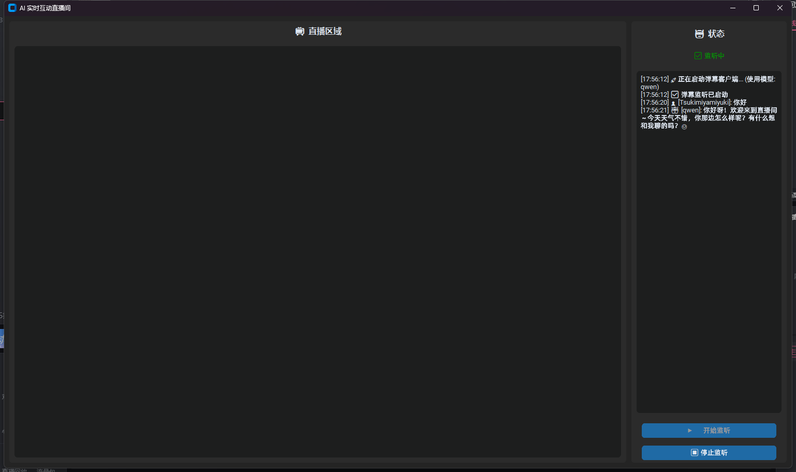

# 🎤 Live Assistant：Bilibili 直播间 AI 互动仪表盘



Live Assistant 是一个基于 Python 开发的 Bilibili 直播间辅助工具。它能够实时抓取直播间弹幕，并结合大语言模型（如通义千问）实现自动化的 AI 互动与回复。项目采用模块化设计，拥有现代化的图形用户界面（GUI），适合二次开发与个人直播使用。

---

## ✨ 核心功能

- **🎨 现代化 UI**：基于 `CustomTkinter` 构建，支持深色/浅色模式切换，提供友好的配置界面。
- **📡 实时弹幕**：利用 `blivedm` 库稳定连接 Bilibili 直播服务器，实时获取弹幕流。
- **🤖 AI 智能驱动**：集成 `dashscope`（通义千问），可根据人设设定自动回复观众提问。
- **⚙️ 配置化管理**：敏感信息（API Key, Access Key）与业务逻辑分离，通过 JSON 文件安全存储。

---

## 🚀 快速开始

### 1. 环境准备
确保你的系统已安装 Python 3.8+。

### 2. 克隆项目
```bash
git clone https://github.com/YUKIQVQ/Live-assistant.git
cd Live-assistant
```
### 3. 安装依赖
推荐使用虚拟环境（Virtual Environment）以避免包冲突。
```bash
pip install -r requirements.txt
```
### 4. 配置密钥
⚠️ 安全警告：请勿在代码中硬编码你的 API Key！
本项目采用配置文件管理密钥：
首先运行配置界面程序：
```bash
python settings_ui.py
```
在弹出的 GUI 窗口中，填入你的：  
API Key (用于调用llm)  
Access Key ID/Secret   
项目id  
主播身份码  
点击“保存配置”，程序会自动生成 config.json。
### 5. 启动主程序
点击“运行程序”

### 🛠️ 配置说明 (config.json)
---
项目运行依赖的 config.json 文件结构如下：

|  字段 | 说明                     |  示例 |
|---|------------------------|---|
|  selected_model | 当前选中的 AI 模型标识          |"qwen"   |
| openai_api_key  | OpenAI 官方的 API 密钥      | "sk-xxxxxxxxxxxxxxxxxxxxxx"  |
|  deepseek_api_key | 	DeepSeek 模型的 API 密钥 | "sk-xxxxxxxxxxxxxxxxxxxxxx"  |
|  access_key_id |    哔哩哔哩开放平台的 Access Key ID                   | "sk-xxxxxxxxxxxxxxxxxxxxxx"  |
|  access_key_secret |        哔哩哔哩开放平台的  Access Key Secret                 | "xxxxxxxxxxxxxxxxxxxx"  |
|    app_id                | Bilibili 开放平台的应用 ID    | "xxxxxxxxxxxxxxxxxxxx"  |
|   room_owner_auth_code                 | 直播间房主专属的身份码            |  "xxxxxxxxxxxxxxxxxxxx" |
### 📦 依赖列表
本项目依赖以下核心库：
---
- customtkinter：现代化的 Tkinter 扩展，用于构建 UI
- blivedm：Bilibili 直播弹幕协议的 Python 实现
- dashscope：阿里云通义千问 SDK
- openai (>=1.0)：OpenAI 官方 Python SDK，用于调用 GPT 系列大模型 
---
完整的依赖列表请参考 requirements.txt。
### blivedm 未发布到 PyPI，必须从 GitHub 安装
- 请确保系统已安装 Git：https://git-scm.com/
- blivedm安装方式如下（已写入 requirements.txt）：
``` txt
git+https://github.com/xfgryujk/blivedm.git@master
```

### 📝 隐私与合规声明
- Bilibili 协议：本项目仅用于学习交流，模拟官方客户端行为，请勿用于大规模商业用途或恶意攻击。
- AI 内容：由 AI 生成的内容仅供参考，开发者不对 AI 生成的言论负责。
- 密钥安全：请妥善保管您的 API Key。
